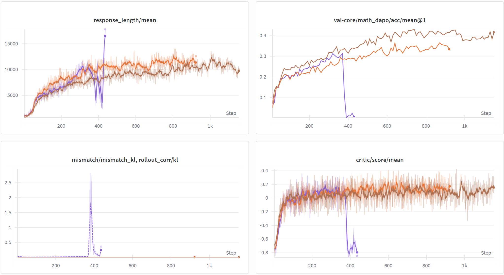
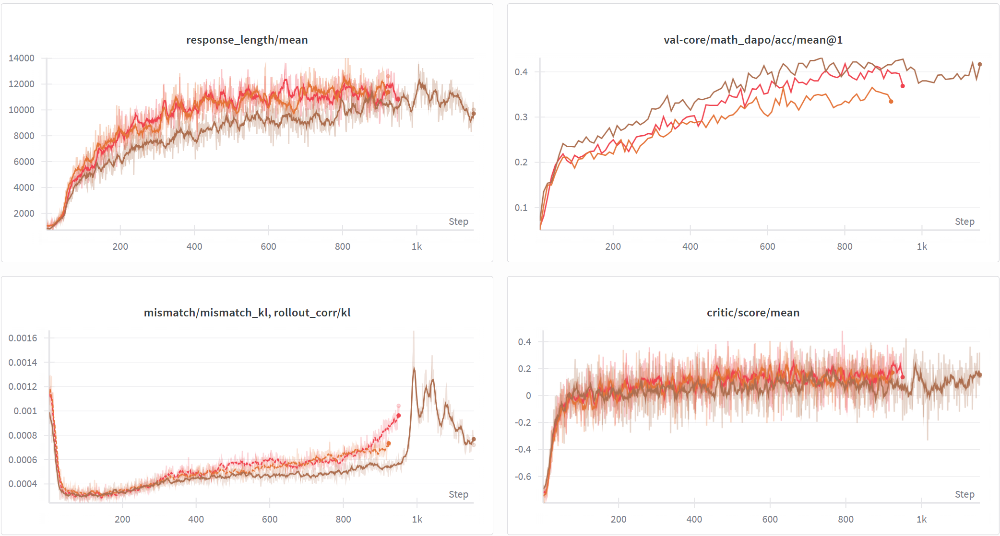
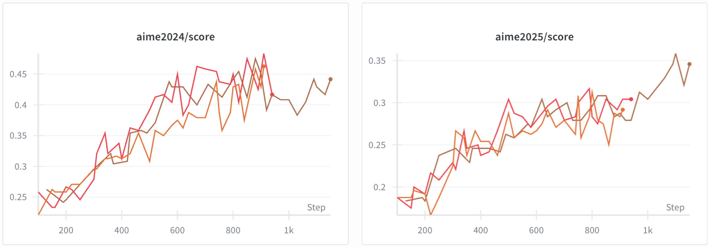
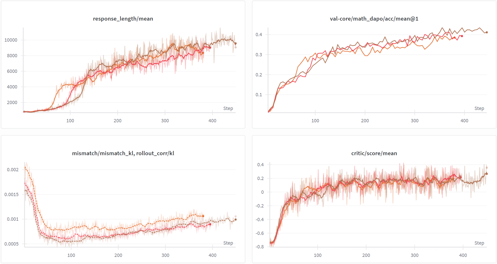

# NVFP4 QAT (Quantization-Aware Training)

This module provides **NVFP4 W4A16 Quantization-Aware Training (QAT)**, enabling seamless integration between FSDP distributed training and vLLM inference engine. This allows **NVFP4 quantized** inference during training without causing KL divergence explosion.

**Dependency**: Requires `vllm==0.15.0`.

---

## Data Preparation

QAT Recipe reuses the DAPO dataset. Download the data before running:

```bash
bash recipe/dapo/prepare_dapo_data.sh
```

---

## Quick Start

### Qwen3-30B-A3B-Base W4A16 Full Quantization

```bash
bash recipe/qat/run_qwen3_30b_w4a16.sh
```

### Qwen3-30B-A3B-Base W4A16 FFN-only Quantization

```bash
bash recipe/qat/run_qwen3_30b_w4a16_FFN_only.sh
```

---

## Key Parameters

### QAT Configuration

| Parameter | Description | Default |
|-----------|-------------|---------|
| `qat.enable` | Enable QAT | `False` |
| `qat.mode` | Quantization mode | `"w4a16"` |
| `qat.group_size` | Quantization group size | `16` |
| `qat.ignore_patterns` | Layer name patterns to ignore (supports regex) | `["lm_head", "embed_tokens", "re:.*mlp.gate$"]` |
| `qat.quantization_config_path` | vLLM quantization config JSON path | `recipe/qat/config/nvfp4_w4a16.json` |

### YAML Configuration Examples

**Full Quantization**:

```yaml
actor_rollout_ref:
  actor:
    qat:
      enable: true
      mode: "w4a16"
      group_size: 16
      ignore_patterns:
        - "lm_head"
        - "embed_tokens"
        - "re:.*mlp.gate$"
      quantization_config_path: "recipe/qat/config/nvfp4_w4a16.json"
```

**FFN-only Quantization** (exclude Attention Linear layers):

```yaml
actor_rollout_ref:
  actor:
    qat:
      enable: true
      mode: "w4a16"
      group_size: 16
      ignore_patterns:
        - "lm_head"
        - "embed_tokens"
        - "re:.*mlp.gate$"
        - "re:.*self_attn.*"
      quantization_config_path: "recipe/qat/config/nvfp4_w4a16.json"
```

---

## Implementation Overview

### Module Structure

```
verl/utils/qat/
├── __init__.py      # Module entry point
├── core.py          # Replaces nn.Linear → QATLinear, sets up scale fusion
├── linear.py        # Defines QATLinear (fake quantization layer with Triton FP4 kernels)
├── quantizer.py     # Packs weights to NVFP4 format for vLLM rollout
└── vllm_patch.py    # vLLM dynamic weight loading patches
```

### QATLinear

`QATLinear` is the core fake-quantized linear layer:

- Inherits from `nn.Linear`, fully compatible with FSDP
- Uses high-performance Triton kernels for FP4 E2M1 quantization
- Supports STE (Straight-Through Estimator) for backpropagation

```
Forward:
  1. weight_fq = fake_quantize(weight)  # Triton FP4 quantize → dequantize
  2. output = F.linear(x, weight_fq, bias)

Backward:
  1. grad passes directly to original weight (STE)
```

### Scale Fusion

To match vLLM's inference optimization, scales of related layers need to be fused:

- **QKV Fusion**: `q_proj`, `k_proj`, `v_proj` share the same `global_scale`
- **Gate/Up Fusion**: `gate_proj`, `up_proj` share the same `global_scale`

Fusion is implemented via `_fusion_siblings_ref` weak references, automatically handled in `_fake_quantize_weight()`.

### vLLM Dynamic Weight Loading Patches

PPO training requires multiple weight updates to vLLM. Native vLLM does not support repeated loading of quantized weights.

### Data Flow

```
┌─────────────────────────┐      ┌─────────────────────────┐
│     Training Phase      │      │     Rollout Phase       │
│    (FSDP + QATLinear)   │      │   (vLLM + NVFP4)        │
├─────────────────────────┤      ├─────────────────────────┤
│ • forward: fake_quant   │      │ 1. Get FSDP full params │
│ • backward: STE         │      │ 2. QATQuantizer quant   │
│ • optimizer.step()      │  ──► │ 3. load_weights()       │
│                         │      │ 4. vLLM Marlin inference│
└─────────────────────────┘      └─────────────────────────┘
```

---

## Experimental Results

All experiments were conducted on B300.

### Experiment 1: Qwen3-8B-Base QAT Comparison

Comparing W4A16 quantized training with and without QAT:

| Config | Description | Color |
|--------|-------------|-------|
| BF16 | Baseline, full precision training | Brown |
| W4A16 (no QAT) | Directly quantize BF16 weights and send to vLLM | Purple |
| W4A16 + QAT | Use Fake Quantization during training | Orange |

**Conclusions**:
- Without QAT, `rollout_corr/kl` is two orders of magnitude higher than BF16, grows rapidly during training, and eventually crashes
- With QAT, KL divergence remains consistent with BF16



### Experiment 2: Qwen3-8B-Base Quantization Strategy Comparison

Comparing different quantization strategies:

| Config | Description | Color |
|--------|-------------|-------|
| BF16 | Baseline | Brown |
| W4A16 + QAT (Full) | Full quantization | Orange |
| W4A16 + QAT (FFN-only) | FFN-only quantization | Red |

**Conclusions**:
- Online evaluation (first figure): During training, each configuration uses its own rollout precision (BF16 rollout for BF16, W4A16 rollout for W4A16), so the online metrics are not directly comparable across precisions. Under this setting, BF16 > FFN-only(W4A16) > Full(W4A16).
- Offline evaluation (second figure, AIME24/25): When all trained checkpoints are evaluated uniformly using BF16 precision, all three configurations achieve similar accuracy, indicating that QAT training does not degrade the model's inherent capability.




### Experiment 3: Qwen3-30B-A3B-Base QAT Validation

Validating QAT effectiveness on larger models. Results are consistent with the 8B experiments.

| Config | Color |
|--------|-------|
| BF16 | Brown |
| W4A16 + QAT (Full) | Orange |
| W4A16 + QAT (FFN-only) | Red |



**Memory Analysis**

Analyzed memory impact of NVFP4 during Rollout phase for Qwen3-30B-A3B-Base.

Config: vLLM rollout settings with `gpu_memory_utilization=0.90`, `max_num_batched_tokens=32768`, `max_num_seqs=256`, `TP=1`.

| Metric | BF16 | W4A16 + QAT (Full) | Change |
|--------|------|---------------------|--------|
| Weight | 56.88 GiB | 16.89 GiB | -39.99 GiB (↓70.3%) |
| KV Cache | 181.26 GiB | 221.26 GiB | +40.00 GiB (↑22.1%) |
| Peak Activation | 2.64 GiB | 2.64 GiB | - |
| Non-torch Memory | 0.14 GiB | 0.14 GiB | - |
| CUDAGraph Memory | -1.34 GiB | -1.16 GiB | +0.18 GiB |

**Conclusion**: NVFP4 W4A16 reduces weight memory by **70.3%** (from 56.88 GiB to 16.89 GiB), freeing up ~40 GiB for additional KV Cache capacity.

---

## Future Improvements

- **W4A4 Mode**: W4A4 logic is included in the code, but currently has KL divergence issues and is not usable
- **Large-scale Models**: Due to VeRL FSDP design limitations, QAT experiments on Qwen-235B and other very large models are not yet supported
